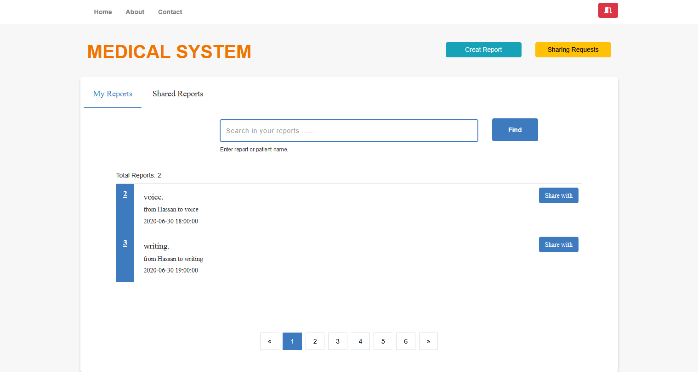
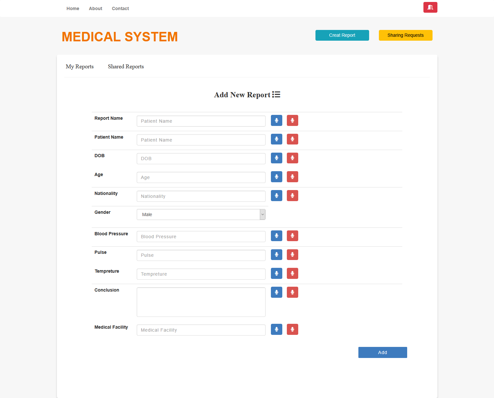

# Online Medical Reports System

Writing medical reports and even recite for pharmacy is a cross panic task as
doctors are always busy and have no time to spend on writing using tradition
keyboard and mouse. 

This system provides more efficient methods for Handling these issues, where doctors can:- 
1. Write the medical examination reports using voice, 
2. Browse the analysis and medication reports.
3. Share reports of the patient with other doctors and ensure privacy of patient.

**Images from the system:-**

* Check more <a href="https://github.com/H-mahmoud/Online-Medical-Reports-System/tree/master/images">Here</a>
